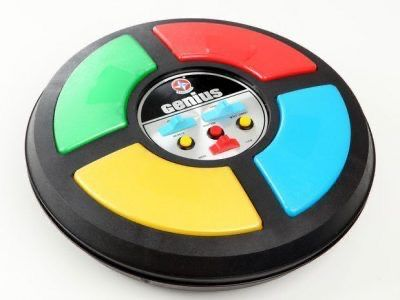
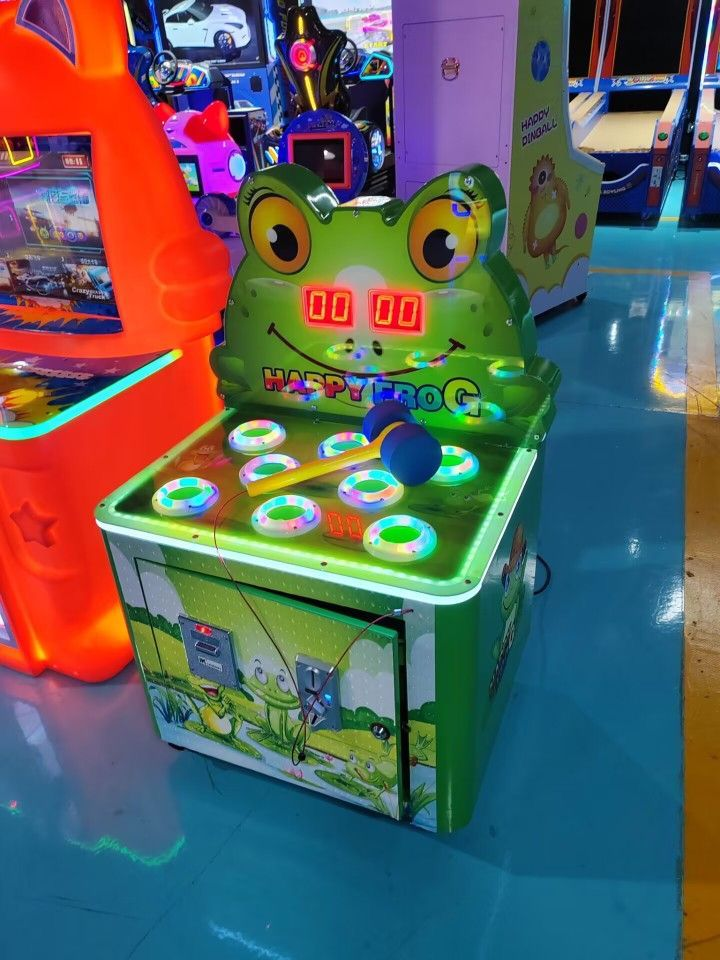

# Relatório Introdução à Computação - Equipe 9  

## Qual era a ideia do trabalho?  
Inicialmente, decidimos fazer um jogo inspirado no **“Jogo da Marmota”**, também conhecido como **“Jogo do Reflexo”**, porém depois de orientação do monitor responsável pela nossa equipe, optamos por ampliar o projeto. Então decidimos fazer um projeto estilo **fliperama** com **3 jogos disponíveis** para o usuário.  

## O que foi feito no trabalho?  
No começo de julho, quando a proposta da Feira de Ciências foi feita para a turma, começamos a discutir qual seria a ideia do projeto e submetemos a proposta pouco tempo depois. Nas próximas semanas, começamos a tentar fazer o código mas enfrentamos algumas dificuldades por se tratar de uma linguagem de programação que não temos tanta facilidade.  

No final do mês, fomos atrás da parte física do projeto: encomendamos um molde de MDF feito sob medida para o nosso fliperama. A partir do dia 1 de agosto, dividimos a equipe em duas partes para agilizar o processo: metade das pessoas ficaram responsáveis por deixar o código funcional, e a outra metade ficou responsável pela montagem do circuito.  

Além disso, fomos na sala maker do CIN, e modelamos um **suporte para o LCD** usado e uma **tampa para o MDF**, garantindo segurança e estabilidade para o projeto.  

## Quais foram as dificuldades encontradas?  
Como já mencionado antes, a principal dificuldade do grupo foi de longe a programação em **C++**, já que estávamos acostumados a trabalhar com **Python** na disciplina de Introdução à Programação.  

Além disso, também enfrentamos alguns problemas com a demora na compra de materiais do CIN e fizemos algumas adaptações:  
- O projeto passou a ter **um LCD em vez de dois**.  
- Não conseguimos usar a **fita LED** que pedimos na época da compra.  
- Problemas no circuito: um botão com LED sem funcionar e outro botão que não estava funcionando, mas depois conseguimos ajustar.  

## Quais foram as referências usadas no trabalho?  

Para fazer o trabalho nos inspiramos em:  
- O famoso jogo de memória **“Genius”**.  
- O **Jogo do Reflexo** ou **“Jogo da Marmota”**.  
- O terceiro jogo (**Matemática**) foi uma ideia do grupo.  

A ideia principal foi a montagem do projeto no **estilo fliperama**, utilizando:  
- Um **display LCD** como análogo à tela.  
- **Cinco botões** para jogar os jogos.  
- Um **joystick** (característico do fliperama) para navegar pelo display.  

## Qual a diferença entre o que foi feito para a referência?  
Nosso intuito foi tentar trazer esses jogos da forma mais semelhante às versões originais possível, adaptando para o que aprendemos esse semestre.  

### Genius  
- **Semelhança**: mecânica do jogo e memorização de cores.  
- **Diferença**: o Genius original possui apenas **4 botões**, enquanto o nosso projeto possui **5**.  

### Matemática  
- Proposta parecida com um **teste de matemática**, porém mais dinâmico.  
- Envolve elementos da **eletrônica** e **ferramentas da computação**.  

### Reflexo  
- **Semelhança**: princípio do jogo se mantém.  
- **Diferença**: no jogo original, as marmotas são distribuídas de forma aleatória e “saltam” quando acionadas.  
- Além disso, no jogo original a quantidade de marmotas (equivalentes aos botões do projeto) é **bem maior**.  
